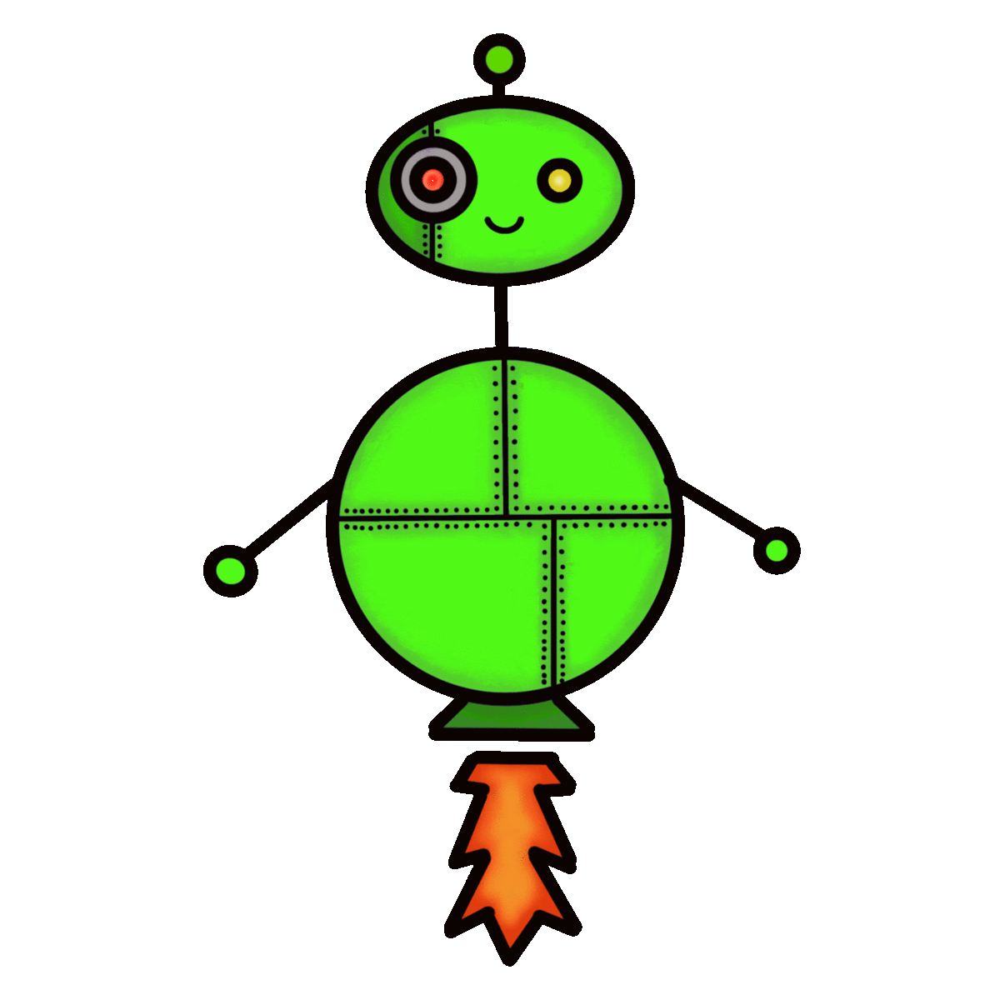

# ForestBot

  

ForestBot is a Minecraft bot that can track player stats such as kills, deaths, playtime, advancements, joindates and more. It can be invited to a Minecraft server to collect and display this data.

## Usage

To use ForestBot, head to the ForestBot website and reqeust him for your Minecraft Server

You can view your stats and learn more by visiting the ForestBot website at https://forestbot.org.

## Contributing

If you would like to contribute to ForestBot, please follow these steps:

1. Fork the repository and create a new branch for your feature or bug fix.
2. Make your changes and commit them with descriptive commit messages.
3. Submit a pull request and describe the changes you've made.
